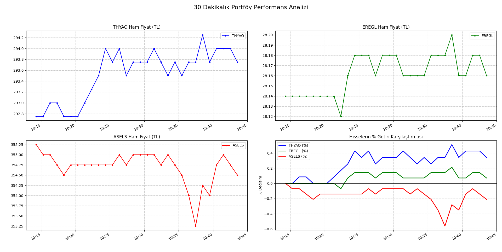

# 📈 Real-Time Portfolio Tracker

This project is a high-performance **Django** backend system integrated with **Docker** and **PostgreSQL** to track and analyze investment instruments (Stocks/Funds) in real-time.

## 🚀 Features
* **Automated Data Ingestion:** Fetches real-time market data via `yfinance`.
* **Database Management:** Uses PostgreSQL running on Docker for reliable time-series data storage.
* **Analytical Visualization:** Generates 2x2 performance grids using `Matplotlib`, including **Percentage Change Normalization** for accurate asset comparison.
* **Django Integration:** Built-in admin panel for managing asset quantities and purchase prices.

## 🛠️ Tech Stack
* **Language:** Python 3.13
* **Backend:** Django
* **Database:** PostgreSQL (Docker)
* **Visualization:** Matplotlib, Pandas
* **DevOps:** Git, Docker

## 🔧 Installation & Setup
1. Clone the repository:
bash

```git clone [https://github.com/erentopacoglu/Real-Time-Portfolio-Tracker-with-Django-Docker.git](https://github.com/erentopacoglu/Real-Time-Portfolio-Tracker-with-Django-Docker)```

Set up the Docker container for PostgreSQL:

Bash
```docker run --name portfolio_db -e POSTGRES_PASSWORD=pass -p 5432:5432 -d postgres```

Install dependencies:

Bash

```pip install -r requirements.txt```

Run the data collector:

Bash

```python price_collector.py```

## 📊 Visualization Example
